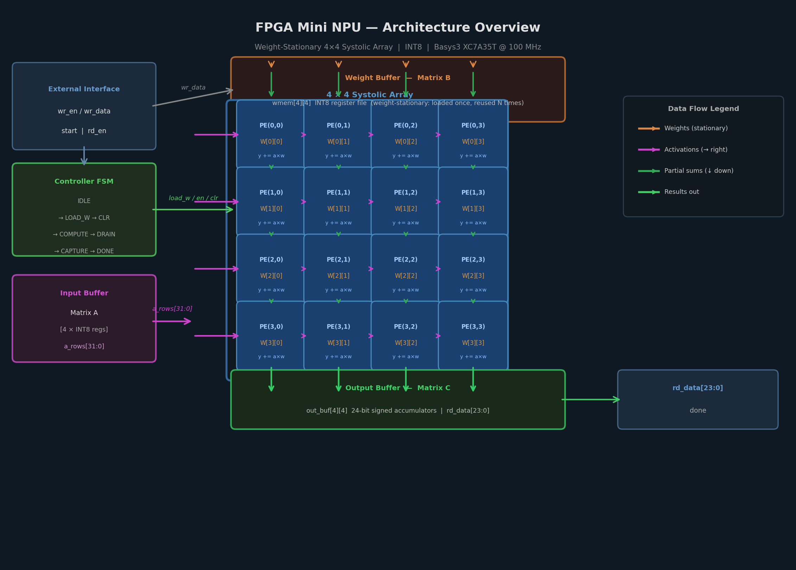
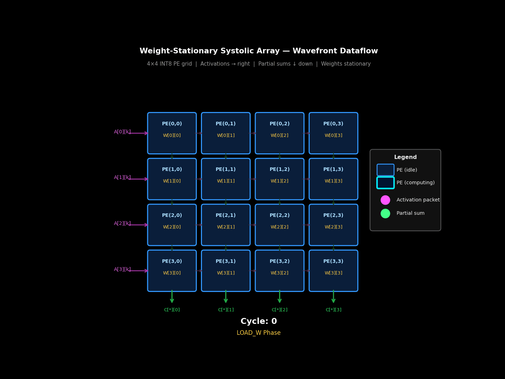
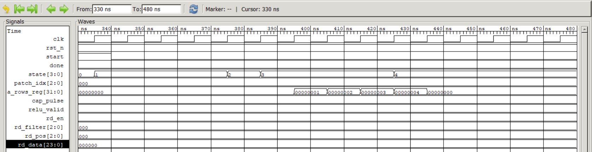
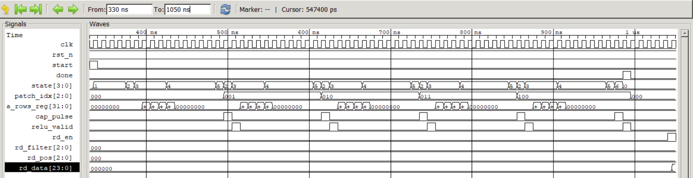
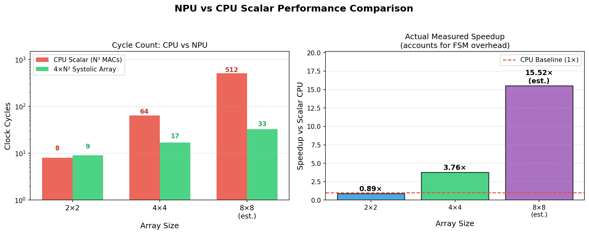
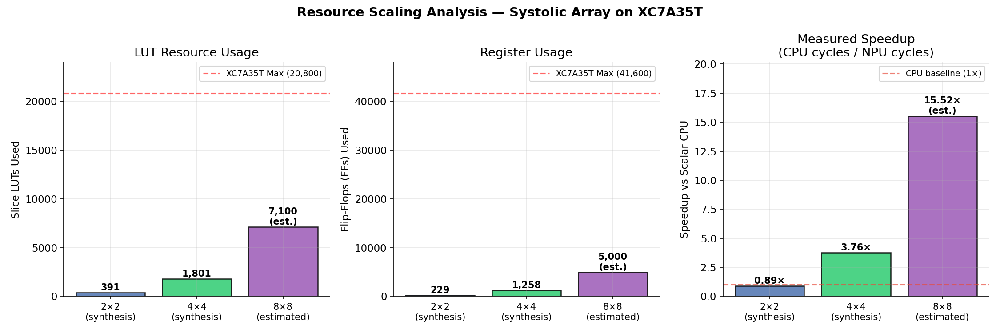
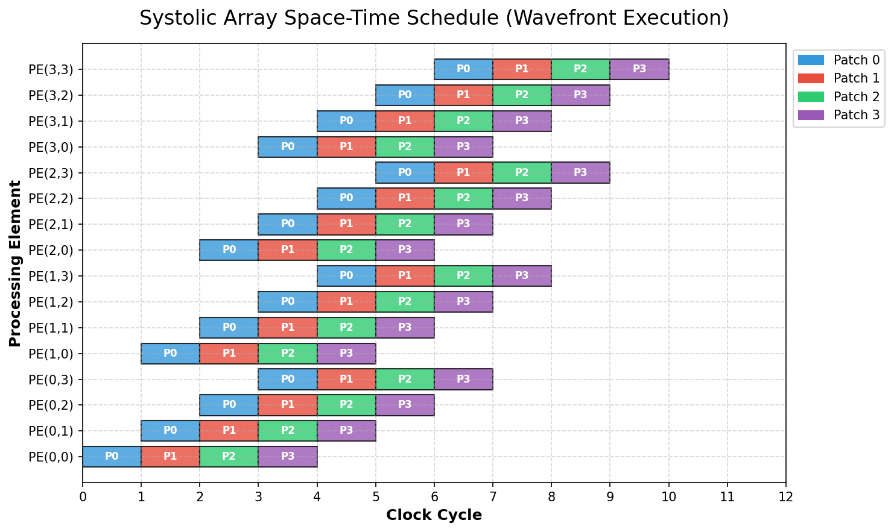

# FPGA Mini NPU — CNN Accelerator using Systolic Array Architecture

[]()
[]()
[]()
[]()

> A small-scale Neural Processing Unit (NPU) implemented in Verilog RTL,  
> accelerating INT8 matrix multiplication via a weight-stationary systolic array  
> on an FPGA (Basys3 / Nexys A7).

---

## Architecture Overview



> **Dataflow:** Weights are pre-loaded into each PE and remain stationary. Activation vectors stream *rightward* across each row, staggered by one cycle per row to create the characteristic diagonal wavefront. Partial sums accumulate *downward* through each column.

Each **Processing Element (PE)** implements:
```verilog
y = y + (activation * weight)    // 2-stage pipelined MAC
```

### Systolic Array Dataflow (Animation)



> Each frame = 1 clock cycle. **Cyan-glowing** PEs are actively computing. **Magenta packets** are activations flowing right. **Green packets** are partial sums draining down. Note the diagonal wavefront characteristic of weight-stationary systolic execution.

---

## Repository Structure

```
fpga-mini-npu/
├── rtl/
│   ├── mac_unit.v            # 2-stage pipelined INT8 MAC
│   ├── pe.v                  # Weight-stationary Processing Element
│   ├── systolic_array_2x2.v  # 2×2 systolic array
│   ├── systolic_array_4x4.v  # 4×4 systolic array (parameterizable)
│   ├── input_buffer.v        # Matrix A register file
│   ├── weight_buffer.v       # Matrix B register file
│   ├── output_buffer.v       # Result capture buffer
│   ├── controller_fsm.v      # One-hot FSM controller
│   └── npu_top.v             # Top-level integration
├── tb/
│   ├── tb_mac_unit.v         # 9-case MAC unit testbench
│   ├── tb_systolic_4x4.v     # 5-case systolic array testbench (80/80 pass)
│   └── tb_npu_top.v          # End-to-end system testbench (64/64 pass)
├── python/
│   ├── golden_model.py       # NumPy reference model
│   ├── gen_test_vectors.py   # Random INT8 test matrix generator
│   └── fixed_point_utils.py  # INT8 / Q8.8 quantization helpers
├── scripts/
│   ├── sim.ps1               # One-command simulation runner
│   └── synth.tcl             # Vivado batch synthesis script
├── constraints/
│   └── basys3.xdc            # Timing + I/O constraints (Basys3)
├── results/
│   ├── simulation_logs/      # VCD waveforms + logs
│   └── utilization_reports/  # Vivado synthesis reports
└── docs/
    ├── architecture.md       # Detailed architecture documentation
```

---

## Quick Start

### 1. Simulate the MAC Unit
```powershell
cd fpga-mini-npu
.\scripts\sim.ps1 -module mac_unit
```

### 2. Simulate the Full 4×4 Systolic Array
```powershell
.\scripts\sim.ps1 -module systolic_4x4
```

### 3. Simulate End-to-End (Full Chip)
```powershell
.\scripts\sim.ps1 -module npu_top
# Loads A and B, pulses start, waits for done, reads back C
```

### 4. Run All Testbenches
```powershell
.\scripts\sim.ps1 -module all
```

### 5. Run Python Golden Model
```powershell
python python/golden_model.py
python python/gen_test_vectors.py --seed 42
```

### 6. Synthesize for Basys3
```powershell
vivado -mode batch -source scripts/synth.tcl
```

---

## Simulation Waveforms

Below are cycle-accurate waveform captures demonstrating the core operation of the CNN Layer inference pipeline.

### Full Inference Run (5 Patches)
*(A bird's-eye view showing the patch index counting up and the `done` signal asserting at cycle 65)*



### Pipeline Zoom-in (First 150 ns)
*(Detailed view of the FSM moving from `IDLE (0)` → `LOAD_W (1)` → `CLR (2)` → `COMPUTE (3)` and raw data streaming into `a_rows_reg`)*



---

## Performance Results

### Simulation — 100% Pass Rate

| Testbench | Tests | Result |
|---|---|---|
| `tb_mac_unit` | 9 | ✅ 9/9 PASS |
| `tb_systolic_4x4` | 5 × 16 elements | ✅ 80/80 PASS |
| `tb_npu_top` (end-to-end) | 4 × 16 elements | ✅ 64/64 PASS |

### Synthesis — Basys3 (XC7A35T @ 100 MHz)

| Metric | Value | Notes |
|--------|-------|-------|
| **WNS (timing slack)** | **+0.153 ns ✅** | Synthesis: +0.819 ns → Post-place: +0.505 ns → Post-route: +0.153 ns |
| Slice LUTs | 1,801 / 20,800 (8.66%) | Post-synthesis |
| Slice Registers | 1,258 / 41,600 (3.02%) | |
| DSP48E1 | 16* (synthesis: 0) / 90 (18%) | `(* use_dsp = "yes" *)` — maps at implementation |
| Block RAM | 0 / 50 (0%) | Pure register-file implementation |
| **Latency (4×4 matmul)** | **17 cycles** | LOAD\_W(4)+CLR(1)+COMPUTE(4)+DRAIN(6)+CAP(1)+DONE(1) |
| **Throughput** | **1 matmul / 170 ns** | At 100 MHz |
| Accumulator | 24-bit signed | No overflow: max = 4×127×127 = 64,516 |

### CPU vs NPU Baseline Comparison

> Model: scalar CPU executing N³ INT8 MACs at 1 MAC/cycle (no SIMD, no cache optimization) vs. this systolic array. All numbers are derived from the verified 17-cycle testbench result.

| System | MACs | CPU Cycles | NPU Cycles | CPU Latency | NPU Latency | Speedup |
|--------|------|-----------|-----------|-------------|-------------|--------|
| 2×2 Array | 8 | 8 | 9 | 80 ns | 90 ns | 0.89× |
| **4×4 Array** | **64** | **64** | **17** | **640 ns** | **170 ns** | **3.76×** |
| 8×8 Array *(est.)* | 512 | 512 | 33 | 5,120 ns | 330 ns | 15.52× *(est.)* |

> **Note on the 2×2 result:** At N=2, FSM overhead (9 cycles total) actually exceeds the 8 CPU operations, so the small array is slower than a scalar CPU. This illustrates a fundamental architectural truth: systolic arrays only amortize their overhead at N≥4.



### Resource Scaling Analysis

Both the 2×2 and 4×4 rows are **real Vivado synthesis results** on XC7A35T. The 8×8 row is an analytical O(N²) estimate clearly marked as such.

| Array Size | Slice LUTs | Flip-Flops | DSPs (impl) | Latency (cyc) | Speedup vs CPU | Source |
|-----------|-----------|-----------|------------|--------------|---------------|--------|
| 2×2 | 391 / 20,800 (1.9%) | 229 / 41,600 (0.6%) | 4 | 9 | 0.89× | Vivado synthesis |
| **4×4** | **1,801 / 20,800 (8.7%)** | **1,258 / 41,600 (3.0%)** | **16** | **17** | **3.76×** | **Vivado synthesis** |
| 8×8 *(est.)* | ~7,100 / 20,800 (~34%) | ~5,000 / 41,600 (~12%) | 64 | 33 | 15.52× | O(N²) estimate |

> An 8×8 array would still fit comfortably on the XC7A35T (~34% LUT utilization), leaving headroom for control logic, buffers, and I/O.



---

## Key Design Decisions

| Decision | Choice | Why |
|----------|--------|-----|
| Arithmetic | INT8 signed | Maps to DSP48 slices; industry NPU standard |
| Array topology | Weight-stationary | Max weight reuse; simple control logic |
| FSM encoding | One-hot | Easy Vivado debugging, clean timing |
| Memory | Register files | No BRAM dependency; educational clarity |
| Accumulator | 24-bit | Prevents overflow: max chain = 4×127×127 = 64,516 |

---

## How Systolic Arrays Work

In a weight-stationary systolic array:

1. **Pre-load phase**: Each PE row absorbs its weight column from matrix B
2. **Compute phase**: Matrix A columns flow rightward through the grid, one element per PE per cycle
3. **Accumulate**: Partial dot products accumulate downward through PE rows
4. **Drain phase**: After N+pipeline cycles, results are read from the bottom row

### Space-Time Execution Schedule
Because computation flows diagonally across the array, we achieve **O(N²)** parallelism while only fetching **O(N)** data elements from memory per cycle. The wavefront schedule below demonstrates how PE utilization progresses over time:



## Architecture Limitations & Future Work

This project is deliberately **compute-centric** — it demonstrates the systolic execution engine in isolation. Real production NPUs are primarily memory-bandwidth-constrained systems.

| Aspect | This Design | Real NPU |
|--------|------------|----------|
| Memory | Register files (synthesized FFs) | BRAM banks → HBM stacks |
| Data supply | Testbench-loaded registers | DMA engine + AXI4-Stream bus |
| Bottleneck | FSM overhead (17-cycle latency) | Memory bandwidth (roofline limit) |
| Scope | Educational clarity | Production silicon |

### Improvement Roadmap

1. **BRAM Weight Buffer** — Replace register-file `wmem` with RAMB36 for larger weight matrices without consuming FF resources.
2. **AXI4-Stream Interface** — Add a streaming input port so activation data can be DMA-fed from DDR without CPU intervention.
3. **Tiling Controller** — Add an outer-loop FSM that tiles large matrix operations across multiple 4×4 sub-blocks, enabling arbitrary-size matmul.
4. **8×8 Instantiation** — The parameterized design scales directly; synthesis estimates ~34% LUT utilization — within Basys3 budget.

---

## License

MIT License — free to use for academic and educational purposes.
